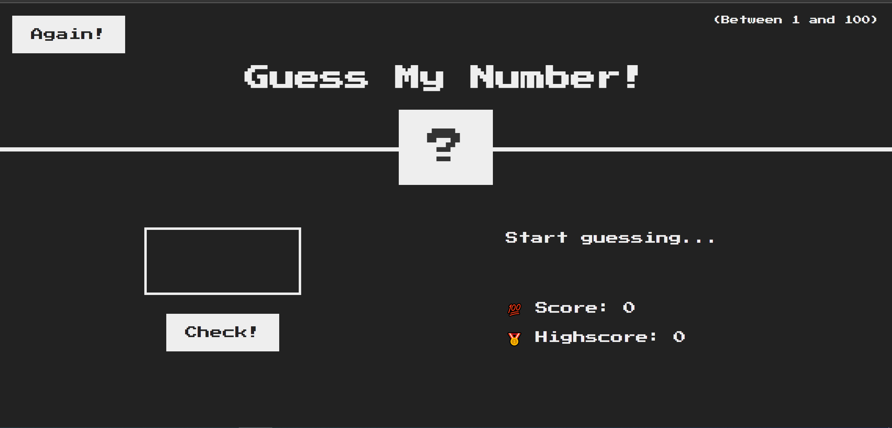

- Play Game.

The goal of the game is to guess a secret number between 1 and 100. The input type should be a number. If the guessed number is lower than the secret number, the message "Too low" should be displayed on the left side. If the guessed number is higher than the secret number, the message "Too high" should be displayed. When the guessed number is correct, the message "Number is correct" should be displayed, and the background color should turn green.

There should also be a score information displayed, which initially starts at a certain value. After each failed guess, the score should decrease by 1. Additionally, there should be a highscore information displayed, which represents the maximum score achieved so far. The highscore information should be saved and updated accordingly.

Furthermore, there should be a button to start the game again, which resets the score and allows the player to make a new guess. The highscore information should be preserved even when the game is restarted.

### Screenshot

### Links

- Live Site URL: [Add live site URL here](https://shorenatsiklauri.github.io/guess-number-assignment/)

## My process

### Built with

- Semantic HTML5 markup
- CSS custom properties
- Javascript

### What I learned

- Javascript "🎉"
